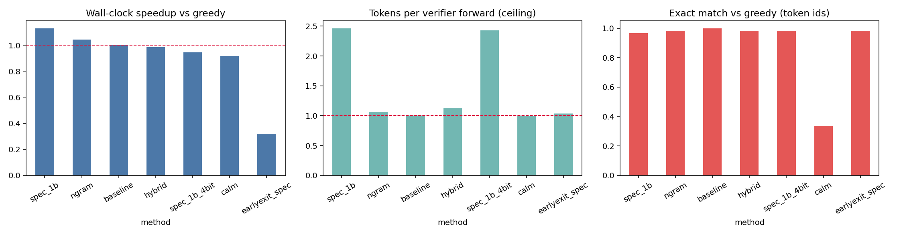
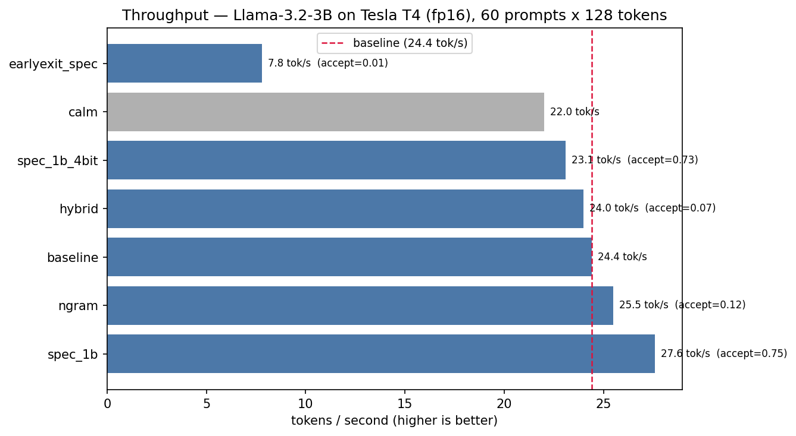

# RetroSpec

RetroSpec measures how much faster large language model inference gets when
you don't make the model do all the work itself — speculative decoding,
retrieval-based drafting, and early-exit strategies, all benchmarked
losslessly against plain greedy decoding on the same hardware, same model,
same prompts.

The core question: if a small model (or a cheap lookup, or half of the big
model's own layers) can guess a few tokens ahead and the big model only has
to *check* those guesses instead of generating every token one at a time,
how much wall-clock time do you actually get back — and does the output
change at all?

## What's in here

- **A speculative decoding engine** (`retrospec/engine.py`) with one
  invariant that everything else depends on: the KV cache never holds a
  token that was rejected during verification. Every method routes through
  the same driver loop, so "baseline" and "sped up" are always compared
  apples-to-apples, not two different code paths.
- **Four drafting strategies** (`retrospec/drafters.py`):
  - `NGramDrafter` — exact suffix lookup over what's been generated so far
  - `HybridDrafter` — n-gram lookup + dense hidden-state kNN, fused with
    reciprocal rank fusion, reusing the verifier's own hidden states as
    free embeddings
  - `ModelDrafter` — a smaller model drafts, the big model verifies
  - `EarlyExitDrafter` — the verifier's own first half drafts for its own
    second half
- **A lossy early-exit baseline** (`retrospec/calm.py`) for measuring the
  speed/quality tradeoff when you *don't* insist on lossless output
- **A benchmark harness** (`retrospec/bench.py`) that pins to one GPU,
  picks fp16 vs bf16 based on actual hardware support, runs every method
  through the identical engine, and scores quality on token-id exact match
  rather than a fuzzy text metric
- **A correctness gate** (`tests/test_engine.py` + a calibration notebook)
  that must pass before any benchmark number means anything: every
  "lossless" method is asserted bit-exact against greedy decoding before
  the full run is allowed to start

## Results

60 prompts (WebQuestions-style short factual questions), 128 tokens/prompt,
3 repeats/prompt with median latency reported, Llama-3.2-3B-Instruct
verifier + Llama-3.2-1B-Instruct drafter where applicable, fp16, single
Tesla T4.





| method | tok/s | speedup | tok/forward | acceptance | exact_match |
|---|---|---|---|---|---|
| **spec_1b** | **27.6** | **1.13x** | 2.46 | 0.75 | 0.97 |
| ngram | 25.5 | 1.04x | 1.06 | 0.12 | 0.98 |
| baseline | 24.4 | 1.00x | 1.00 | — | 1.00 |
| hybrid | 24.0 | 0.98x | 1.12 | 0.07 | 0.98 |
| spec_1b_4bit | 23.1 | 0.95x | 2.43 | 0.73 | 0.98 |
| calm | 22.0 | 0.92x | 0.99 | — | 0.33 |
| earlyexit_spec | 7.8 | 0.32x | 1.04 | 0.01 | 0.98 |

**A genuinely smaller model (1B) drafting for the 3B verifier is the clear
winner: 1.13x wall-clock speedup, losslessly.** Everything else here is a
real, measured negative or near-neutral result, not a placeholder:

- **`ngram` / `hybrid`** come out flat because this dataset is short
  open-ended questions with nothing to retrieve — no passage, no repeated
  spans. Retrieval-based drafting needs grounded or repetitive content
  (summarization, RAG, code editing) to show a win; see
  `retrospec/data.py: make_grounded_variants()` for building a slice where
  it's expected to help, and compare that slice against the open-domain
  one before concluding either drafter "doesn't work."
- **`spec_1b_4bit`** is slower than the fp16 original, not faster — nf4
  dequantization overhead outweighs its savings at batch size 1. It buys
  VRAM headroom, not latency.
- **`earlyexit_spec`** is 3x *slower* despite skipping half the verifier's
  layers. On a T4, kernel-launch overhead per layer at batch size 1
  dominates over the FLOPs saved by skipping — the theoretical savings
  don't show up as wall-clock savings on this hardware. Still fully
  lossless, just not viable here.
- **`calm`** is intentionally lossy (`exact_match = 0.33`) and is *still*
  slower than baseline — it runs a full forward pass and then adds an
  extra `lm_head` projection on top, so it was bounded above ~0.9x before
  any tuning could help. Included as a quality/speed tradeoff measurement,
  not a candidate for actual use.

### Why `exact_match` isn't 1.0 for lossless methods

Every method above marked lossless is *mathematically* guaranteed to
reproduce greedy decoding exactly — but in fp16 that guarantee only holds
up to floating-point rounding. Batched multi-token verification and
sequential single-token generation compute the same numbers in a slightly
different order, and on the rare token where the top-2 candidates are a
near-tie, that's enough to flip which one wins argmax. Traced one such
divergence directly: the two competing tokens scored `0.3080` and `0.3032`
probability — a `0.0048` margin, well inside fp16 noise. That single flip
then cascades through every token generated after it (autoregressive
generation means everything downstream depends on what came before), which
is why one near-tie can turn into a fully different sentence, and why
`exact_match` on 60 prompts lands at 97-98% rather than either 100% or
something alarmingly low. Bit-exactness end-to-end is only guaranteed in
fp32.

## Repo layout

```
retrospec/            the decoding engine
  engine.py              core driver loop, KV-cache invariant, TorchVerifier
  drafters.py            NGramDrafter, HybridDrafter, ModelDrafter, EarlyExitDrafter
  calm.py                lossy early-exit baseline
  bench.py               benchmark harness: model loading, timing, quality scoring
  data.py                dataset loading, auto-detects question/context columns
tests/
  test_engine.py          mock-LM losslessness tests — no GPU needed, runs in <1s
01_correctness_and_calibration.ipynb   correctness gate + draft-length sweep
02_full_benchmark.ipynb                 full benchmark run + plots
configs/
  calibration_v3.json      gamma values, written by the calibration notebook
results/
  v3_results.json           full benchmark output
  v3_summary.png             plots above
  v3_throughput.png
```

## Quickstart

```bash
python tests/test_engine.py      # no GPU needed — must pass before anything else
```

On a GPU machine (developed against Kaggle's T4x2 / P100), in order:

1. **`01_correctness_and_calibration.ipynb`** — asserts every lossless
   method is bit-exact against greedy decoding on a handful of probe
   prompts, then sweeps draft length (`gamma`) per drafter and writes
   `configs/calibration_v3.json`. **Don't skip this.** If the final
   assertion fails, stop — a benchmark run on a broken engine isn't a
   benchmark, it's noise.
2. **`02_full_benchmark.ipynb`** — point `CSV` at your dataset, run every
   method, get the summary table and plots above.

Needs an `HF_TOKEN` secret if you're using gated Llama checkpoints. To
avoid that, swap `VERIFIER_NAME`/`DRAFTER_NAME` for an ungated pair from
the same tokenizer family, e.g. `Qwen/Qwen2.5-1.5B-Instruct` +
`Qwen/Qwen2.5-0.5B-Instruct` — the verifier and drafter must always share a
tokenizer.

## Method summary

| method | lossless | idea |
|---|---|---|
| `baseline` | — | greedy decoding, through the same engine as everything else |
| `ngram` | yes | exact suffix lookup over the sequence generated so far |
| `hybrid` | yes | n-gram + dense hidden-state kNN, fused with reciprocal rank fusion |
| `spec_1b` | yes | small model (1B) drafts, large model (3B) verifies |
| `spec_1b_4bit` | yes | same, nf4-quantized drafter — VRAM-lean, not latency-lean |
| `earlyexit_spec` | yes | first half of the verifier's own layers draft, full model verifies |
| `calm` | **no** | logit-lens early exit — quality/speed tradeoff measurement only |

## Design notes / known limitations

- Single GPU, fp16 (T4 has no bf16 tensor cores; the harness detects this
  automatically and picks the right dtype — don't hardcode bf16 on older
  hardware, it runs but slower than fp16 due to emulation).
- Never use `device_map="auto"` for benchmarking on a multi-GPU box unless
  you actually want to measure PCIe transfer cost — it shards a model that
  fits on one GPU across several, which roughly doubles latency and adds
  noise for no benefit here.
- The benchmark dataset used above has no grounding/context column, which
  structurally disadvantages `ngram`/`hybrid`. See
  `retrospec/data.py:make_grounded_variants()` and compare the grounded
  vs. open-domain split before concluding those drafters don't work in
  general — they don't work *on this kind of prompt*.
- `EarlyExitDrafter` swaps in a truncated `ModuleList` per forward call,
  which is correct but not kernel-optimized; a fused custom kernel would
  likely change where it lands relative to the other methods.
- Quality is scored on token-id exact match against greedy output, not
  ROUGE or another fuzzy text metric. A fuzzy metric can look fine while
  hiding real divergence (a decoder that goes off the rails after ten
  tokens can still score ~0.6 ROUGE-L and look like a tuning problem
  rather than a correctness bug) — exact match doesn't have that failure
  mode, at the cost of needing the fp16-near-tie caveat above to interpret
  correctly.

## What went wrong building this, and what it took to fix

Kept this section because none of it got smoothed over after the fact —
these are the actual failures hit while building and running the project,
in the order they happened, with what caused each one and what fixed it.

**The core correctness bug.** The very first version of the speculative
decoder kept a rejected draft token's key/value entry in the KV cache after
a verification mismatch, instead of discarding it — so the model ended up
attending to a token it had never actually emitted, and every subsequent
prediction was conditioned on corrupted state. Replayed that exact
bookkeeping against a deterministic mock model with no floating-point noise
involved at all, to isolate the bug from hardware-precision effects:
**60 out of 60 runs diverged from correct greedy decoding.** Not
occasionally — always. It stayed invisible for a while because quality was
first scored with ROUGE-L against a reference, which degrades gracefully;
a decoder that goes off the rails after a handful of tokens still scores
respectably on ROUGE and just looks like a tuning issue instead of a
correctness bug. Switching the quality metric to token-id exact match is
what actually surfaced it — a lossless method either matches 100% (modulo
fp16 noise, see above) or something is actually broken, no gray area to
hide in. The fix was a single invariant: the cache holds exactly the
tokens that were verified and kept, `pending == [seq[-1]]` after every
step, no exceptions — and a test suite running that invariant against a
deterministic mock LM, so the property gets checked in under a second with
no GPU required, before any real model is ever touched.

**The retrieval drafters were both wrong and slow at the same time.** The
datastore backing the n-gram and hybrid drafters rebuilt its entire index
from scratch after every single accepted token — an O(n) rebuild, in a
Python loop, per generated token — which alone cost more than the model's
own forward pass. Separately, the sparse retriever used a bag-of-words
scorer, which throws away token order; for continuing a token sequence,
order is the only thing that matters, so it was retrieving the wrong kind
of match even when it retrieved something. And the dense retriever's index
included the query vector itself, so its top result was usually just
finding itself. Fixed by making both indices incremental (O(1) amortized
per token), swapping the sparse retriever for exact suffix matching (which
is what actually matters for continuing a sequence), and excluding the
query's own neighborhood from the dense search.

**Benchmark timing wasn't apples-to-apples.** The baseline ran through one
code path and the sped-up methods ran through a different hand-written
loop that did extra unnecessary work (requesting hidden states on every
forward pass regardless of whether that method needed them) — so part of
the measured "slowdown" for some methods was just doing more work than the
method they were being compared against. Fixed by routing every method,
baseline included, through the exact same driver loop, and only requesting
hidden states for the one method that actually consumes them.

**Getting it onto Kaggle correctly took several tries.** Referenced a
GitHub path before the code was actually pushed there. When it was pushed,
it landed as five loose files at the repo root instead of inside a proper
package folder with an `__init__.py` — two of those files use relative
imports (`from .engine import ...`), which only resolve inside an actual
package, so `import retrospec` failed a second time for a different
reason. A tokenizer's `apply_chat_template` call returned a shape the
encoding helper didn't normalize correctly, so token ids silently became
loose characters of a string, which surfaced several cells later as a
cryptic `torch.tensor` dimension error rather than at the point where it
actually went wrong. A dataset's question column got auto-detected
incorrectly — the loader picked the widest text column as a fallback,
which happened to be the answers column, not the questions column, on a
CSV whose schema wasn't checked first. None of these were subtle:
each one was found, isolated, and fixed within one debugging pass, but
each also would have been avoidable by checking one thing first — that the
push actually happened, that the package had the folder structure Python
imports require, that a helper function's return value was the type it
claimed to be, that `df.columns` was inspected before trusting an
auto-detector on an unfamiliar file.

None of the process issues above touched the final numbers — the decoding
engine passed its correctness gate every single time it was checked,
including on the full 60-prompt GPU run that produced the results table.
They're included here because a benchmark result without the process that
produced it is much easier to accidentally misuse than one with it.

## License

MIT (or match whatever license fits your use — update this line for your
actual repository).
